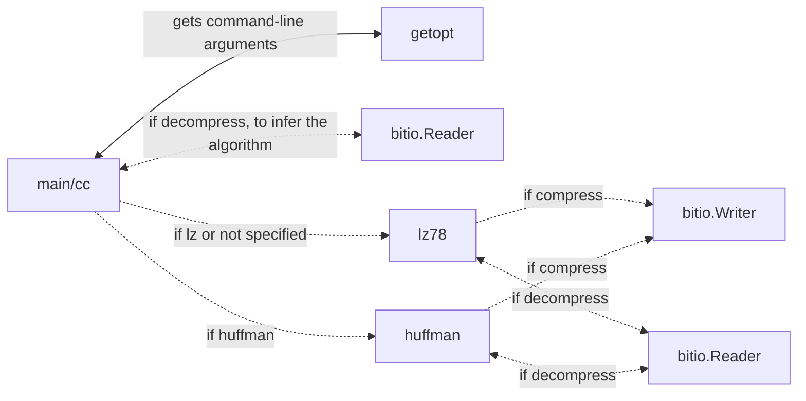

# Implementation report

## Overall structure of the program

The source directory is split into 4 directories: root, lz78, huffman, and utils.

The root folder holds 3 files (excluding CMakeLists).

- Main.cpp contains the main function of the program which serves as an entry point. It only forwards the received arguments to the cc-funtion in the compress.cpp file.
- Compress.cpp is the de facto main function of the program. It parses the arguments, throws errors if there are problems with them, and calls the appropriate compression/decompression functions.
- Compress.h is the header file for compress.cpp.

The lz78 folder holds 2 files (excluding CMakeLists).

- lz78.cpp contains the implementation of the lz78 compression/decompression algorithms. It uses the writer class from utils/bitio.cpp when compressing and the reader class when decompressing.
- lz78.h is the header file for lz78.cpp

The huffman folder holds 2 files (excluding CMakeLists).

- huffman.cpp contains the implementation of the Huffman coding compression/decompression algorithms. It uses the writer class from utils/bitio.cpp when compressing and the reader class when decompressing.
- huffman.h is the header file for huffman.cpp

The utils folder contains 3 files (excluding CMakeLists).

- bitio.cpp contains the writer and reader class implementations. These are used to write and read information on the bit level from byte-level .bin files.
- bitio.h is the header file for bitio.cpp
- getopt.h is a header file which provides the getopt-function that parses command line arguments. It is needed for the arguments to work on Windows.

The program structure can be represented as a flow chart:

where:
- Dashed Line: Represents an optional call.
- One-Ended Arrow: Represents a unidirectional call, where the left node calls right and does not receive a return value.
- Two-Ended Arrow: Represents a bidirectional call, where the left node calls right and potentially receives a return value.

## Potential flaws

After analysing the times of each step in an algorithm, it seems that the majority of the time is taken by the writing and reading operations. I am certainly not an expert at writing I/O stuff, so this could potentially be made faster. 

## LLM usage

I have used ChatGPT as an alternative search tool while making the project. For example, when needing example data to test the project I used it to search for potential sources of large text files, and got the Project Gutenberg library as a response.

## Additional sources

Alongside the Wikipedia-articles mentioned in the specifications document, I have used these sources:

For LZ78:
- [https://faculty.kfupm.edu.sa/ics/saquib/ICS202/Unit31_LZ78.pdf](https://faculty.kfupm.edu.sa/ics/saquib/ICS202/Unit31_LZ78.pdf)
- [https://www.stringology.org/DataCompression/lz78/index_en.html](https://www.stringology.org/DataCompression/lz78/index_en.html)

For Huffman coding:
- [https://stackoverflow.com/questions/759707/efficient-way-of-storing-huffman-tree](https://stackoverflow.com/questions/759707/efficient-way-of-storing-huffman-tree)
- [https://www.programiz.com/dsa/huffman-coding](https://www.programiz.com/dsa/huffman-coding)