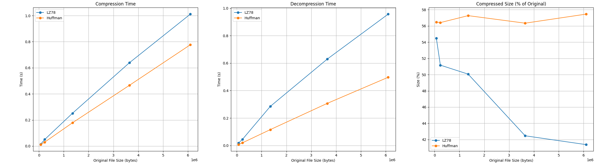

# Testing report

## Test coverage

The live test coverage report can be found from codecov:

## Testing

The program is tested automatically with unit tests and manually with efficiency testing

## Unit testing

The compression algorithms are unit tested with varying input sizes from 1 byte to ~1MB. 
The tests compare each line of the original and decompressed files and fails if they don't match.
The main function of the program is unit tested with possible error cases.
The main tests also verify that the main function interacts correctly with the compression functions.
So they could be considered as end-to-end tests as well. 
The unit tests can be replicated by building the project with CMake (using GCC) and then running CTest in the build directory.

## Efficiency testing

The program's efficiency is tested manually by running the program on .txt file eBooks containing natural language from the Project Gutenberg library.
The test inputs are converted into ASCII only, as the program does not support UTF-8 characters.
The tests are run on a PC with i7-10700k CPU and Samsung 970 EVO Plus SSD.

The selected test inputs are:

| Number | Title | Size |
|---- | ----- | ------------- |
| 1 | [Harrods for Everything by Harrods Ltd.](https://www.gutenberg.org/ebooks/61985)  | 6 098 928 bytes |
| 2 | [Henley's Twentieth Century Formulas, Recipes and Processes by Gardner Dexter Hiscox](https://www.gutenberg.org/ebooks/53143) | 3 647 553 bytes |
| 3 | [Terminal Compromise by Winn Schwartau](https://www.gutenberg.org/ebooks/79)  | 1 352 182 bytes  |
| 4 | [Soldering, Brazing and Welding by Bernard E. Jones](https://www.gutenberg.org/ebooks/52074) | 232 944 bytes |
| 5 | [Hitchhiker's Guide to the Internet by Ed Krol](https://www.gutenberg.org/ebooks/39) | 70 552 bytes |

### Results: LZ78

| File Number | Compression time | Compressed size | Decompression time |
|---- | ----- | ------------- | ---- |
| 1 | 0.997554 s | 2 523 983 bytes (41.384% of original) | 0.947925 s |
| 2 | 0.636617 s | 1 549 077 bytes (42.4689% of original) | 0.622523 s |
| 3 | 0.248689 s | 676 879 bytes (50.0583% of original)  | 0.280689 s |
| 4 | 0.0496594 s | 119 188 bytes (51.1659% of original) | 0.0443276 s |
| 5 | 0.0144075 s | 38 446 bytes (54.4931% of original) | 0.0174719 s |

### Results: Huffman

| File Number | Compression time | Compressed size | Decompression time |
|---- | ----- | ------------- | ---- |
| 1 | 0.773198 s | 3 503 596 bytes (57.4461% of original) | 0.491377 s |
| 2 | 0.461918 s | 2 054 791 bytes (56.3334% of original) | 0.294589 s |
| 3 | 0.177548 s | 774 266 bytes (57.2605% of original) | 0.111617 s |
| 4 | 0.0304467 s | 131 391 bytes (56.4045% of original) | 0.0191236 s |
| 5 | 0.0103944 s | 39 845 bytes (56.4761% of original) | 0.0063338 s |

### Analysis

Based on the test results it seems that the Huffman coding algorithm is faster in both compression and decompression.
This time difference gap seems to grow for both compression and decompression with the latter growing faster.

In terms of compression efficiency, the LZ78 gets better results.
As the input size grows larger, the LZ78 algorithm gets more size reduction.
Notably, it seems that the input size has no effect on the compression efficiency of the Huffman coding algorithm.
Some of the larger files actually get worse results than smaller ones. 